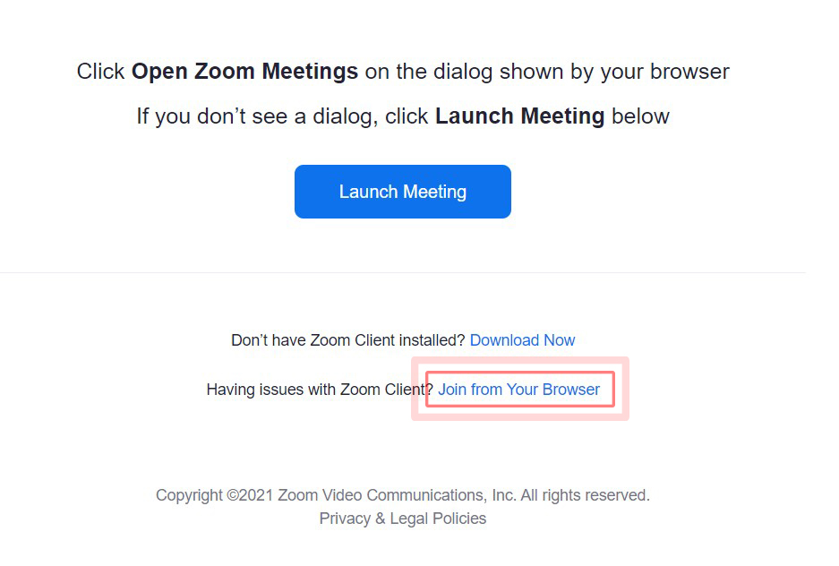
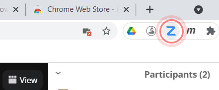
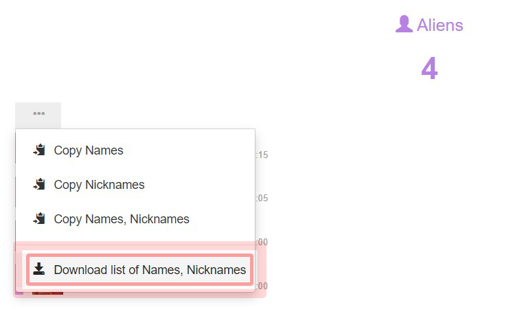

  

<h5 align="center">Google Chrome Extension</h5>

  Chrome extension for monitoring participants in Zoom meeting application
   
   

## What is Zoomex

Zoomex is a google chrome extension which can be used to monitor and watch users activity in [zoom](http://zoom.us/) meetings. 
After openning a [zoom](http://zoom.us/) meeting session in google chrome browser, zoomex extension will be available on extensions tab. By click on zoomex extension icon, the interface of application will appear. On the Zoomex interface you can monitor and track users absence, new users who not authorized for meeting, unmuted microphones and turned off camera of participants.

## Features

- Show the list of current online participants in session
- Show the list of disconnected users during the meeting
- Upload the list of participants
- Download and save the list of participants
- Copy list of partcipants e.g. absents or disconnected to the clipboard by one click
- Show the participants, whos names are not in the pre-defined list
- Show absent users, based on uploaded participants list
- Show the participants, whos camera are off
- Show the participants, whos microphones are not muted
- Generate and download report of participants absence and duration(beta)

## How to install

- Be sure that you installed [Google Chrome](https://www.google.com/chrome/)
- Open Google chrome
- Open the [Chrome Web Store](https://chrome.google.com/webstore/category/extensions)
- Click on ´Search the store´ input field and enter ´zoomex´.
- Find the Zoomex card and click ´Add to Chrome´.
- To use the extension, click the ´Extensions´ icon on the right of the address bar and pin the Zoomex extension on the extension bar.
- Open the link of [Zoom meeting](http://zoom.us/) you have and click on ´Launch Meeting´. By click on Cancel button of popup box, a new link ´Join from Your Browser´ will be appear. Click on this link to enter Web application zoom meeting.

    

- The Zoomex extension icon now would be activate on the right side of addressbar.

    

- Click on Zoomex icon
- You can click on ´New Window´ of zoomex to have a better look on application interface

Important: You can't add extensions when you browse in Incognito mode or as a guest.

## How to use

- Click on ´Clan Data´ on menu bar to clean old cached data
- By starting the meeting, all participants list will appear on ´Aliens´ section
- Click on ´Meatball menu´ on ´Aliens´ section and click on ´Download list of names, nicknames´ and save it some where on your computer.

    

- You can open this file in [Excel](https://www.microsoft.com/en-ww/microsoft-365/excel) or [Notepad](https://notepad-plus-plus.org/) and edit the first column with the real name of participants. Please note that you shouldn't change second column. You can rename this file to participants list or something else.
- On the Zoomex interface, click on ´Upload´ button on top menu and select your edited file.
- Each participant left bar color will be change based on following status:
    - *Green*: The user is online in the meeting
    - *Orange*: The user was in the meeting, but currently is disconnected
    - *Red*: The user is absent
- You can use this file in all next sessions and you don't need to re-generate it.

## Important notice

Please note that this extension is completely related to [Zoom web-application](http://zoom.us/) and any update on the application will cause to stop properly working of this extension. Then please let me know if any part of extension is stop to working: < ma.nourizadeh[a]gmail.com >

## Contact us

Please feel free to fork the repository or contact me if you want to make any changes on application by sending an email to < ma.nourizadeh[a]gmail.com >

## License

Zoomex is released under the MIT license:

The MIT License

Copyright (c) 2014 - 2017 < ma.nourizadeh[a]gmail.com >

Permission is hereby granted, free of charge, to any person obtaining a copy of this software and associated documentation files (the "Software"), to deal in the Software without restriction, including without limitation the rights to use, copy, modify, merge, publish, distribute, sublicense, and/or sell copies of the Software, and to permit persons to whom the Software is furnished to do so, subject to the following conditions:

The above copyright notice and this permission notice shall be included in all copies or substantial portions of the Software.

THE SOFTWARE IS PROVIDED "AS IS", WITHOUT WARRANTY OF ANY KIND, EXPRESS OR IMPLIED, INCLUDING BUT NOT LIMITED TO THE WARRANTIES OF MERCHANTABILITY, FITNESS FOR A PARTICULAR PURPOSE AND NONINFRINGEMENT. IN NO EVENT SHALL THE AUTHORS OR COPYRIGHT HOLDERS BE LIABLE FOR ANY CLAIM, DAMAGES OR OTHER LIABILITY, WHETHER IN AN ACTION OF CONTRACT, TORT OR OTHERWISE, ARISING FROM, OUT OF OR IN CONNECTION WITH THE SOFTWARE OR THE USE OR OTHER DEALINGS IN THE SOFTWARE.